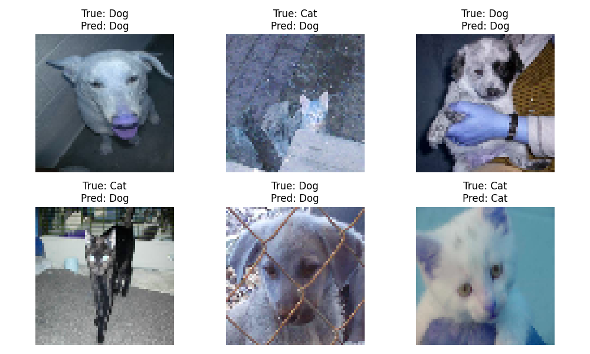

# 🐶🐱 Dogs vs Cats Image Classifier using SVM

This project implements a simple image classifier to distinguish between **cats** and **dogs** using a **Support Vector Machine (SVM)** in Python. The classifier is trained on the [Kaggle Dogs vs Cats dataset](https://www.kaggle.com/c/dogs-vs-cats).

---

## 🗂️ Project Structure

```
dogs-vs-cats-svm/
├── svm_classifier.py       # Main Python script for training/testing the SVM
├── .gitignore              # To ignore large files like the dataset
├── README.md               # Project overview and usage instructions
├── train/                  # Folder with cat and dog images (not uploaded to GitHub)
└── sample_images/          # Optional small set of test images
```

---

## ⚙️ Requirements

Install the following Python libraries:

```bash
pip install numpy opencv-python scikit-learn matplotlib tqdm
```

---

## 📥 Dataset

1. Go to the [Kaggle Dogs vs Cats competition](https://www.kaggle.com/c/dogs-vs-cats)
2. Click **"Join Competition"** and accept the terms
3. Download `train.zip` and extract it to a folder named `train/` inside this project

Each image will be named like:
- `cat.0.jpg`, `cat.1.jpg`, ..., `cat.12499.jpg`
- `dog.0.jpg`, `dog.1.jpg`, ..., `dog.12499.jpg`

---

## 🚀 How to Run

```bash
python svm_classifier.py
```

The script will:

- Load and preprocess a limited number of images (e.g., 1500 cats + 1500 dogs)
- Flatten and resize them to 64x64
- Train an SVM classifier (linear kernel)
- Evaluate and display classification results
- Optionally show sample predictions with matplotlib

---

## 📊 Output Example

```
[INFO] Loading data...
[INFO] Training SVM...
[INFO] Evaluating...
Accuracy: 0.74
Classification Report:
              precision    recall  f1-score   support

        Cat       0.74      0.73      0.74       300
        Dog       0.74      0.75      0.74       300

   micro avg       0.74      0.74      0.74       600
```

---

## 📌 Notes

- Dataset is **not included** in this repository due to size and license restrictions.
- Images are resized and flattened for SVM input.
- For better performance, consider using feature extraction like **HOG** or **PCA**.
- If you face issues with the Kaggle API, check that your `kaggle.json` is correctly placed in `~/.kaggle/`.

---

## 📸 Sample Visualization


> _Examples of true vs. predicted labels from the SVM classifier_
---

## 📄 License

This project is for educational purposes only. Dataset belongs to Kaggle and is licensed under their terms.

---


## 👨‍💻 Author

**Your Name**  
GitHub: [@Yash-Sharma1511-ji]([https://github.com/your-username])